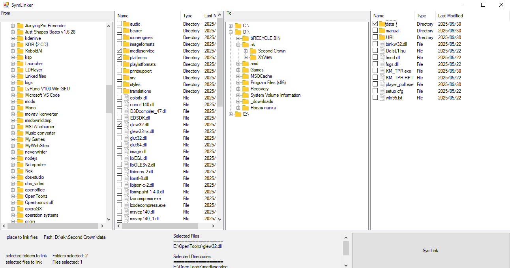

# Download

[View all releases](https://github.com/sanscross/SymLinker/releases)

# SymLinker
An app for quickly making SymLinks (symbolic links) with no preparation. The app will move all the files to desired folder and make a symlink in few clicks

# How to use
1. on the left side (under the from) you have a basic file explorer window, there you can open folders contents of which you want to simplink
2. once you opened a folder, next to the tree explorer there's a selector. there you can select as many files and folders as you want
3. after that on the left side you look for the folder in which you want to save. Again like in the first two steps you pick it.
4. under the explorer part check all the files in the list and amount of files.
5. Click "SymLink" button
6. Done! A window with detailed logs about the proccess will open
7. Close the console window and repeat the process with new files

# Roadmap
1. Redo ui and add themes
2. fix symlinking of symlinks
3. Add de symlinking (reverse proccess)
4. Add new features and make symlinking faster